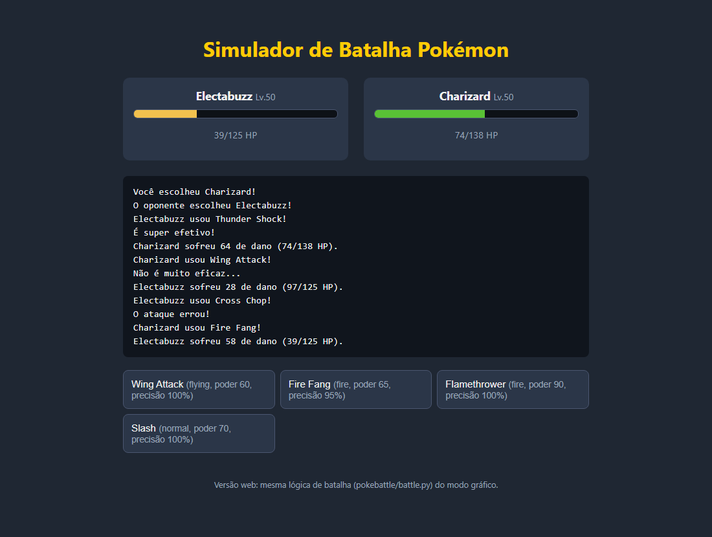

# Simulador de Batalha Pokémon



Jogo de batalha Pokémon por turnos em Python. O centro do projeto é reproduzir a fórmula de dano e a tabela de tipos dos jogos oficiais, com o cálculo feito de verdade a cada turno. A mesma lógica de batalha (`pokebattle/battle.py`) roda em duas interfaces: um modo gráfico completo em Tkinter e uma versão web mais simples em Flask.

É o primeiro projeto da minha trilogia Pokémon. O segundo é o Team Builder e o terceiro é o Extrator de Dados.

## Como rodar

Precisa de Python 3.10 ou mais novo.

```bash
pip install -r requirements.txt
python main_gui.py        # modo gráfico
python web/app.py         # versão web, em http://127.0.0.1:5000
```

No Linux, se o Tkinter não vier junto com o Python, instale o pacote `python3-tk` do sistema.

## Modo gráfico

O modo gráfico busca qualquer Pokémon na PokéAPI, com stats, tipos, golpes, habilidade e ilustração oficial. A primeira aparição de cada Pokémon ou golpe precisa de internet; depois disso tudo fica em cache na pasta `.pokecache/`. O progresso do jogador fica em `savegame.json`.

O que dá pra fazer:

- montar times de até 6 Pokémon, com busca que filtra enquanto você digita;
- jogar com IV, EV e natureza sorteados, como nos jogos, e dar apelido a cada Pokémon;
- usar golpes com efeito de verdade: queimadura, veneno, paralisia, sono, congelamento, confusão, prioridade, recuo, dreno de HP, mudança de atributo, clima e ataques de dois turnos;
- contar com um conjunto de habilidades com efeito real, como Intimidate, Levitate, Sturdy, Wonder Guard e Speed Boost;
- ganhar XP, subir de nível, aprender golpes e evoluir pela cadeia real da PokéAPI;
- enfrentar os 8 ginásios de Kanto em ordem, ganhar insígnias e dinheiro;
- comprar poções, itens de treino de EV, itens segurados (Leftovers, Choice Band, berries), Mega Stones e até Pokémon na PokéMart;
- cumprir missões de 6 NPCs e desbloquear conquistas;
- escolher a dificuldade, com treinadores agressivos, defensivos ou estratégicos, e uma IA que se adapta à sua taxa de vitória;
- jogar PvP local no mesmo computador, disputar torneio contra 3 rivais e ativar o modo Nuzlocke;
- exportar e importar times num formato parecido com o do Pokémon Showdown, trocar Pokémon entre saves e rever batalhas salvas;
- achar Pokémon shiny (1 em 4096) e batalhar em arenas que favorecem um tipo, como vulcão, lago, caverna e geleira.

Os sons são sintetizados pelo próprio programa com a biblioteca padrão, então o projeto não usa nenhum arquivo de áudio de terceiros. Sem placa de som, o jogo roda em silêncio.

## Versão web

Um servidor Flask com o roster fixo de 41 Pokémon (`pokebattle/data.py`), que funciona sem internet. Você filtra pela letra, escolhe o seu Pokémon e o computador sorteia o adversário. Cada partida fica na memória do servidor, ligada à sessão do navegador, e o servidor guarda no máximo 500 partidas ao mesmo tempo. O modo debug do Flask só liga com `FLASK_DEBUG=1`.

## A fórmula de dano

O dano segue a fórmula dos jogos: nível do atacante, poder do golpe, Ataque contra Defesa (ou Ataque Especial contra Defesa Especial, conforme a categoria), bônus de 1,5x quando o golpe é do mesmo tipo do Pokémon, efetividade de tipo, crítico com chance de 1/16 e 1,5x de dano, e a variação aleatória de 85% a 100%. A tabela tem os 18 tipos, incluindo Fada, e vale para Pokémon de um ou dois tipos. Os stats saem da mesma conta dos jogos, a partir do nível, dos base stats, do IV, do EV e da natureza.

## Estrutura

```
main_gui.py          interface Tkinter
web/                 interface Flask (app.py, templates/ e static/)
pokebattle/
  battle.py          cálculo de dano e a classe Battle (turnos, troca, item, fuga, clima)
  pokemon.py         stats com IV, EV e natureza, status e estágios de atributo
  moves.py           golpes e seus efeitos
  types_chart.py     tabela de efetividade
  status.py          efeitos de status
  abilities.py       habilidades com efeito mecânico
  held_items.py      itens segurados
  mega.py            mega evolução
  ai.py              escolha de golpe por dificuldade e personalidade
  pokeapi.py         cliente da PokéAPI com cache em disco
  roster.py          monta Pokémon a partir da PokéAPI
  data.py            roster fixo da versão web
  progression.py     XP, level up, golpe novo e evolução
  save.py            save em JSON
  gyms.py, items.py, quests.py, achievements.py, locations.py, tournament.py,
  nuzlocke.py, teamcodec.py, trade.py, replay.py, audio.py, avatar.py, sprites.py
```

A lógica de batalha não desenha nada nem lê o teclado. Por isso as duas interfaces usam a mesma classe `Battle`, e a rede fica isolada em `pokeapi.py` e `roster.py`.

## O que eu treinei com esse projeto

Orientação a objetos com `Pokemon`, `Move` e `Battle`, e uma regra de negócio com bastante matemática: a fórmula de dano multiplica uns seis fatores, e o cálculo de stats soma IV, EV e natureza por cima. Separar lógica de interface foi o que deixou o projeto crescer sem virar bagunça: a versão web nasceu reaproveitando a mesma `Battle` do modo gráfico.

No modo gráfico, treinei consumir uma API HTTP com cache em disco, buscar dados em paralelo com `ThreadPoolExecutor` e rodar chamadas de rede numa thread separada sem travar a janela, trazendo o resultado de volta pra thread do Tkinter. Também modelei a máquina de estados dos status e escrevi as primeiras heurísticas de decisão da IA, comparando golpes pelo dano esperado em vez do poder bruto.
